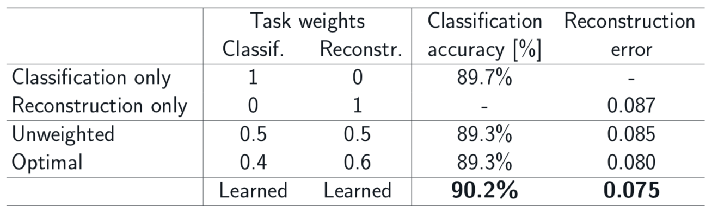
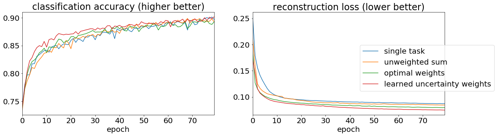

# Reproduction of 'Multi-Task Learning using Uncertainty to Weigh Losses for Scene Geometry and Semantics'

[Kendall, Y. Gal and R. Cipolla. Proceedings of the IEEE Conference on Computer Vision and Pattern Recognition (CVPR), 2018](http://arxiv.org/abs/1705.07115)

Reproduction implemented by D. Baerg, O. Key, J. Materzynska, and M. Tong as part of the MSc Computer Science at the University of Oxford.

In many applications of machine learning it is beneficial to have a single model achieve several objectives simultaneously. This can be more computationally efficient and produce more accurate results than training separate models for each task [1]. However, this opens the question of how to combine the losses from each individual task into a single overall loss.

One option is to use a simple weighted sum of the loss of each individual task. However, using a grid search to find the weights can be very expensive, and may not find the optimal values because it is limited in resolution. The weights might also have varying optimal values at different epochs during training, and so any value of the fixed weights may not be optimal for the entire training procedure.

The hypothesis that the paper presents and tests is that a multi-task model will achieve higher accuracy when using a loss which weights each task by a function of its homoscedastic aleatoric uncertainty, rather than by fixed weights. Moreover, a multi-task model will achieve higher accuracy than several single task models learning each task individually.

For more details, including the derivation of the loss function, see [`reports/aml_report_oscar_key.pdf`](reports/aml_report_oscar_key.pdf) or the original paper.

## Our results

On a simple task, using the Fashion MNIST dataset, we are able to reproduce results analogous to those in the original paper.

On the Cityscapes task, as used by the original paper, we are unable to reproduce the baseline results. We ran out of time during the project to debug the baselines.

Again, for more details see [`reports/aml_report_oscar_key.pdf`](reports/aml_report_oscar_key.pdf).


### Fashion MNIST task
The model performs two tasks. The first is classification of the input image into one of the 10 classes. The second is to compress the image down to a low dimensional representation, and then reconstruct the original image (i.e. an autoencoder). In a similar fashion to the original paper, the model has a larger shared encoder module and two small decoders, one for each task. 

We use the cross-entropy loss function for the classification task, and the L2 loss function from the reconstruction task. We follow similar steps to the original paper to derive the overall loss function, see [`mnist_loss.py`](multitask-learning/mnisttask/mnist_loss.py).

The results below, analogous to those in the original paper, demonstrate that weighting the loss of each task by a function of the learned heteroscedastic variance of the task results in higher accuracy than setting the weights by grid search, or when training each task individually.

This supports the hypothesis of the original paper, however only weakly because the Fashion MNIST task is not as rich as the majority of real-world tasks in computer vision.

<p align="center">
 <br>
<em>Results on the Fashion MNIST task</em>
</p>

<p align="center">
 <br>
<em>Graphs showing classification accuracy and reconstruction error for the different loss functions</em>
</p>


## Running the code
Initialise the environment using `pipenv install`.

To use [Sacred](https://github.com/IDSIA/sacred) with a database, create a file `multitask-learning/sacred_creds.py` with two constants `url` and `database_name`. See the [Sacred docs](https://sacred.readthedocs.io/en/stable/observers.html#mongo-observer) for how to configure these.

To use Sacred without a database, use the command line argument `with save_to_db=False`.

### Fashion MNIST
```
pipenv shell
PYTHONPATH="multitask-learning" python3.7 multitask-learning/mnisttask/mnist.py with save_to_db=False
```
See [`mnist.py`](multitask-learning/mnisttask/mnist.py) for configuration arguments.

### Cityscapes
Request, download and extract the [Cityscapes dataset](https://www.cityscapes-dataset.com)
```
pipenv shell
PYTHONPATH="multitask-learning" python3.7 multitask-learning/cityscapestask/main.py with save_to_db=False root_dir_train=... root_dir_validation=...
```
Set `root_dir_train` and `root_dir_validation` to the training and validation sets downloaded from Cityscapes.

In the original paper the authors run several experiments on 'Tiny Cityscapes', which is a downsampled version of the full-size dataset. `scripts/create_tiny_cityscapes.py` will create this smaller dataset.

[1] [Baxter, Jonathan. "A model of inductive bias learning." Journal of artificial intelligence research 12 (2000): 149-198.](http://www.jair.org/papers/paper731.html)
